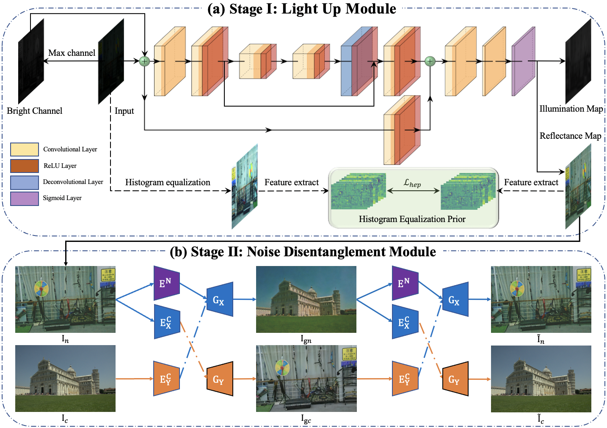
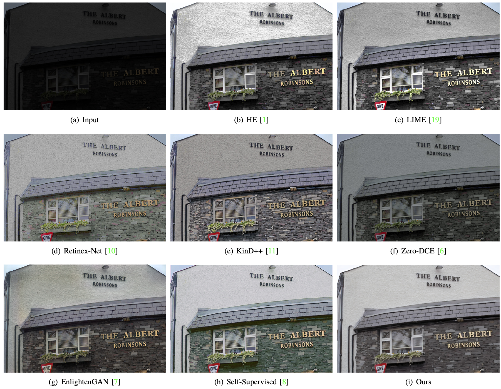

[Unsupervised Low-Light Image Enhancement via Histogram Equalization Prior](https://arxiv.org/abs/2112.01766)

The code will release soon.

## Implementation
* Python3
* PyTorch>=1.0
* NVIDIA GPU+CUDA

## Guidance
The code will release soon.

## Paper Summary
HEP consists of two stages, Light Up Module (LUM) and Noise Disentanglement Module (LUM)


## Representative Visual Results




README waits for updated, more visual results will release soon

## Citation
if you find this repo is helpful, please cite
```
@article{zhang2021unsupervised,
  title={Unsupervised Low-Light Image Enhancement via Histogram Equalization Prior},
  author={Zhang, Feng and Shao, Yuanjie and Sun, Yishi and Zhu, Kai and Gao, Changxin and Sang, Nong},
  journal={arXiv preprint arXiv:2112.01766},
  year={2021}
}
```
